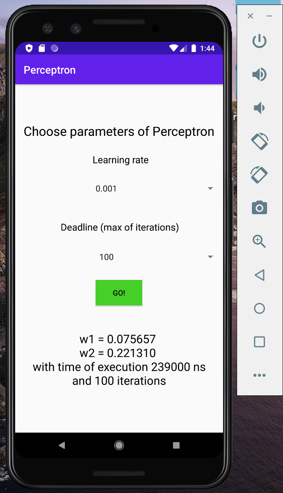
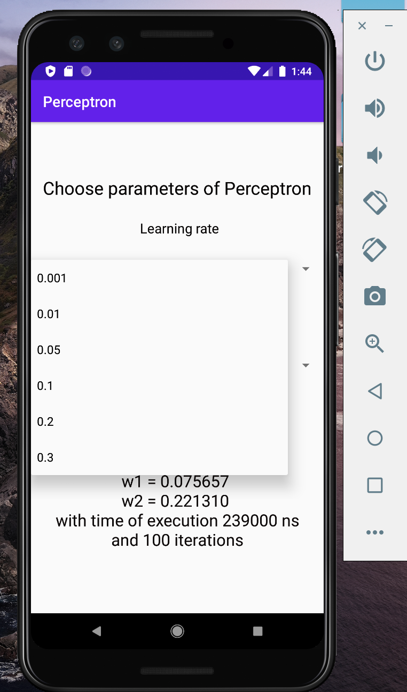
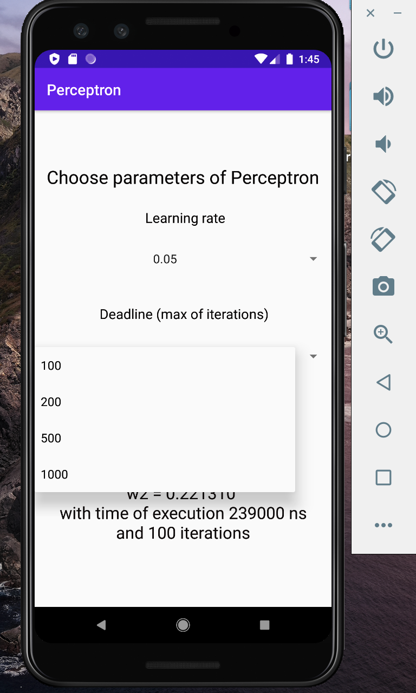
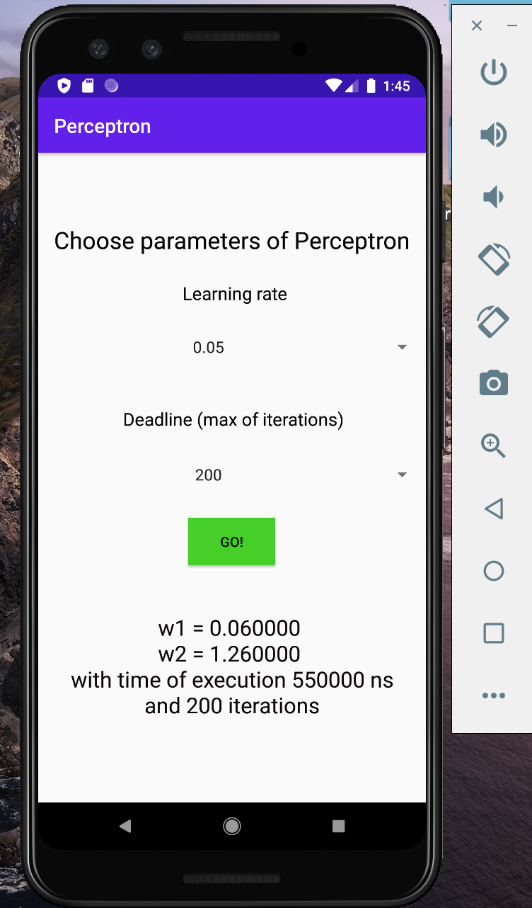
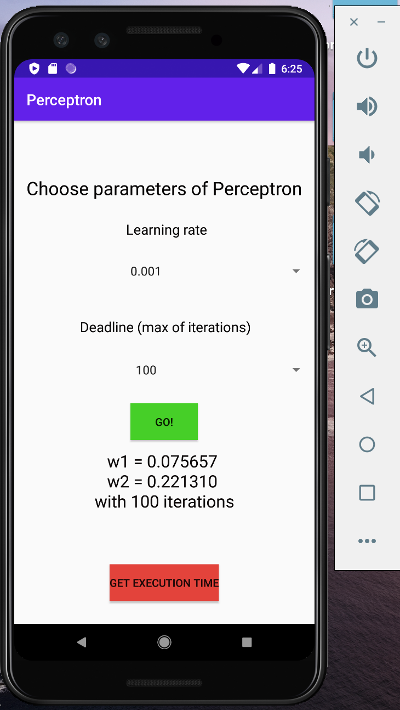
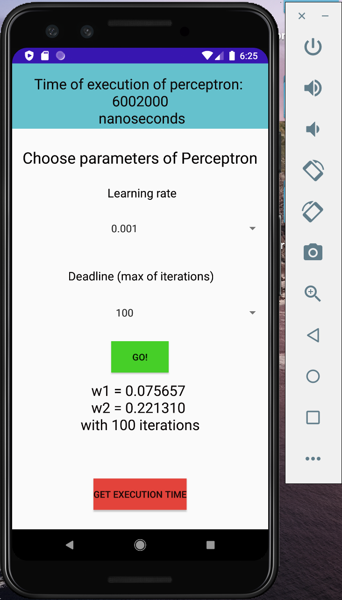

# RealTimeSystemsLab3.2
Simple Perceptron

Main core is perceptron function, which you can find here:
RealTimeSystemsLab3.2/Perceptron/app/src/main/java/com/example/perceptron/MainActivity.java

If you run the app in the emulator (Android Studio), you can see something like this:

Choose your learning rate and deadline (number of iterations): 

See results (Press "GO" button)

(Recently added)
If you want to see time of execution, then press the "See execution time" button:

Pop-up window:

